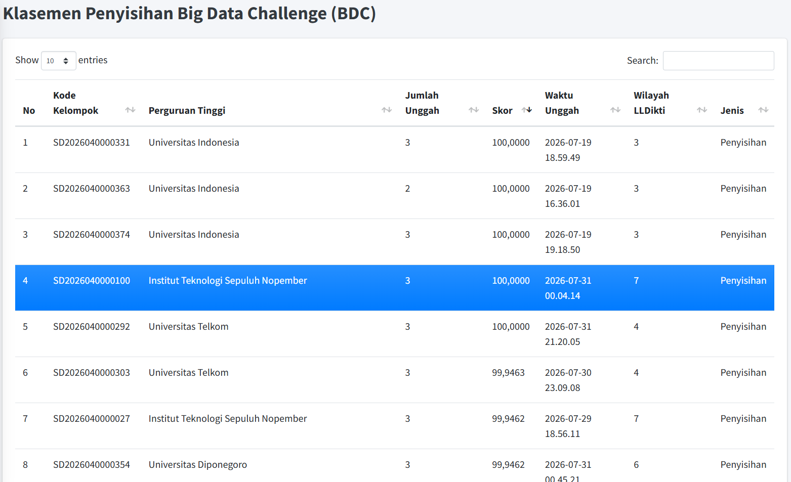

# SATRIA DATA BDC Waste Classification with SigLIP 2 NaFlex
[](https://drive.google.com/drive/folders/1HqgH6jOyKvGx2DrG9LYS7nvSQ2ghbVZ-?usp=sharing)

Standalone Modal training pipeline for classifying recyclable, electronic, and organic waste images. The repository contains the training script, run instructions, and a small archive of the selected run; the image dataset and model checkpoints are not included.

## Repository layout

```text
.
├── .gitignore
├── README.md
├── modal_pipeline.py
├── inference.py
├── modal_inference.py
├── requirements-inference.txt
├── assets/
│   └── leaderboard-bdc.png
└── artifacts/
    ├── audited514-error-logloss-a100-ajeng/
    │   ├── logs/
    │   │   ├── metrics.json
    │   │   ├── run_metadata.json
    │   │   ├── training_history.jsonl
    │   │   └── validation_head_ablation.tsv
    │   ├── submissions/
    │   │   └── submission_SD2026040000100.csv
    │   └── model/
    │       ├── README.md
    │       ├── config.json
    │       ├── preprocessor_config.json
    │       ├── balanced_lr.joblib
    │       ├── features.npz
    │       ├── probabilities.npz
    │       ├── manifest_audited_final.csv
    │       ├── manifest_changes.csv
    │       ├── pipeline_snapshot.py
    │       ├── submission.csv
    │       ├── metrics.json
    │       ├── run_metadata.json
    │       ├── training_history.jsonl
    │       ├── validation_head_ablation.tsv
    │       ├── artifact_checksums.sha256
    │       └── artifact_inventory.json
```

## Result and how to interpret it

The archived run recorded the following Fold-0 validation result:

| Validation set | Selected head | Errors | Macro-F1 | Log loss |
|---|---:|---:|---:|---:|
| 5,308 images; 514-adjustment target | Balanced Logistic Regression, `C=0.2` | 42 | 0.993515 | 0.026980 |

The 514-row relabel set was developed after inspecting evaluation examples and their labels, so this result is not a blind estimate of competition generalization. The resulting label mapping is embedded in the script.

The included screenshot records submission `SD2026040000100` with a score of `100,000` on the BDC scoreboard.



## Dataset

Download the SATRIA DATA BDC image dataset separately. It is deliberately excluded from this repository and should not be uploaded to GitHub.

Expected directory layout:

```text
BDC2026/
├── train/
│   ├── 0_Recyclable/    # 9,999 images
│   ├── 1_Electronic/    # 3,961 images
│   └── 2_Organic/       # 12,567 images
└── test/                # 1,458 images, numbered 1–1458
```

There are 26,527 labeled training images and 1,458 images for prediction. The label codes are `0 = Recyclable`, `1 = Electronic`, and `2 = Organic`. The script expects this folder tree at `/data/BDC2026` inside Modal. It reads the image folders only.

The recipe applies two embedded label mappings for different stages:

- **259 adjustments** (`feature_labels`) are used while fine-tuning the image encoder and selecting its checkpoint.
- **514 adjustments** (`final_labels`) are used to train and select the final logistic-regression head. The historical post-adjustment class counts are 10,379 / 3,964 / 12,184.

These are not two interchangeable counts: the encoder training stage uses the 259-adjustment mapping; the final head uses the 514-adjustment mapping.

## Pipeline

1. Read the three training folders and the 1,458 prediction images.
2. Group identical training files by SHA-256 and create a seeded, stratified five-fold split. Fold 0 (5,308 images) is used for validation.
3. Fine-tune `google/siglip2-so400m-patch16-naflex`, pinned to revision `cc24074f717b612951c2dead130904ab9b65a81e`, with at most 256 patches per image.
4. Train a three-class classifier and an auxiliary binary head on the encoder features. The binary head is an auxiliary training objective, not an ensemble member.
5. Run a one-epoch audited continuation, extract image features, then fit a balanced logistic-regression head using the 514-adjustment labels.
6. Select `C` from `0.1`, `0.2`, `0.3`, `0.5`, `0.75`, and `1.0` using Fold-0 results in this order: fewest errors, lowest log loss, highest Macro-F1, then smallest `C`.
7. Write predictions for the numbered images to `results/submission.csv`.

Encoder checkpoints are selected during the feature-label phase using the 259-adjustment validation labels. The final logistic-regression `C` selection uses the 514-adjustment validation target. The values above describe the archived run; they are not guaranteed to repeat exactly.

## Model and training settings

- Encoder: SigLIP 2 SO400M NaFlex vision encoder; pinned Hugging Face revision above.
- Resolution handling: NaFlex processor, maximum 256 patches.
- Split: `StratifiedGroupKFold`, 5 folds, seed `2026`; duplicate images are kept in the same group.
- Training: 2 head-only epochs, 4 partial fine-tuning epochs (last four encoder blocks), then 1 audited continuation epoch (last two blocks).
- Optimizer: AdamW, weight decay `0.05`; cosine learning-rate schedule with 5% warmup.
- Learning rates: classifier head `3e-4` (head-only), then `5e-5` (partial); unfrozen encoder blocks `2e-6`; continuation head `1e-5` and last two encoder blocks `5e-7`.
- Batch size: 32; mixed precision: BF16.
- Augmentation: horizontal mirroring and mild color jitter during training.
- Auxiliary binary-loss coefficient: `0.20`; cross-entropy label smoothing: `0.05`.
- Classifier: balanced logistic regression, `C` selected using the validation rule above.
- Modal GPU: one A100 40 GB.

## Run on Modal

Install the Modal CLI and authenticate, then select the Modal profile/workspace where the dataset volume and secret are available. From this repository folder:

```powershell
python -m pip install modal
modal setup
modal profile activate <your-profile>
```

Create the dataset volume if needed and upload the dataset folder. The source code mounts this volume at `/data` and reads `/data/BDC2026`:

```powershell
modal volume create bdc2026-data
modal volume put bdc2026-data .\BDC2026 /BDC2026
```

Create the Hugging Face secret expected by the script (or add the same `HF_TOKEN` key to an existing secret named `huggingface-secret`):

```powershell
modal secret create huggingface-secret HF_TOKEN=hf_your_token
```

Then start the run:

```powershell
modal run --detach modal_pipeline.py
```

To retrain from scratch at this repository's dedicated Modal output path:

```powershell
modal run --detach modal_pipeline.py --force
```

`--force` replaces only this recipe's dedicated output directory, `/cache/satria_data_bdc_waste_classification_siglip2_naflex`; it does not target any pre-existing recipe output directory. The Modal cache volume is named `bdc2026-model-cache`. The code creates that volume if it does not already exist.

## Outputs

The archived run files are grouped under `artifacts/audited514-error-logloss-a100-ajeng/`. Its `logs/` directory contains records from 2026-07-30:

- `logs/training_history.jsonl`: per-epoch training loss and Fold-0 metrics.
- `logs/validation_head_ablation.tsv`: validation results for each candidate `C`.
- `logs/metrics.json`: selected recipe and validation summary.
- `logs/run_metadata.json`: runtime, GPU, and model revision metadata.
- `submissions/submission_SD2026040000100.csv`: archived submission file.

These are persisted run artifacts, not a complete raw Modal console transcript. For a future run, export the Modal logs with:

```powershell
$stamp = Get-Date -Format "yyyyMMdd-HHmmss"
modal app logs satria-data-bdc-waste-classification-siglip2-naflex --tail 1000 --timestamps > "artifacts\audited514-error-logloss-a100-ajeng\logs\modal-console-$stamp.log"
```

New lightweight outputs are also downloaded into the local `results/` folder. The compact feature matrix and classifier used to reproduce the archived predictions are included in the tracked inference bundle. Dataset files, local results, and unverified large checkpoint downloads are excluded by `.gitignore`.

## Inference and reproduction artifacts

The compact, checksummed inference bundle is in `artifacts/audited514-error-logloss-a100-ajeng/model/`. It includes the saved Logistic Regression head and the 47 MB archived feature matrix. The 1.7 GB encoder checkpoint (`naflex_audited.pt`, SHA-256 `8fe2069ab5e7730fd45e5eb2bd97935676b997cefd579cdc70fd79dad492d81d`) is not tracked in Git; raw-image inference is only valid with a checkpoint that matches this hash.

Install the small inference dependencies, then regenerate predictions from the archived embeddings (no GPU needed):

```powershell
python -m pip install -r requirements-inference.txt
python inference.py --output results/submission-from-archived-features.csv
```

This path was checked against the archived submission: all 1,458 predicted labels match exactly. For raw-image inference, provide a checkpoint whose SHA-256 matches `artifact_inventory.json`:

```powershell
python -m pip install torch==2.8.0 torchvision==0.23.0 transformers==4.56.2 pillow==11.3.0
python inference.py --test-dir BDC2026/test --checkpoint path\to\naflex_audited.pt --output results/submission-from-images.csv
```

The raw-image path verifies the checkpoint and classifier against archived checksums, loads the saved processor/configuration, extracts features, rounds them to the same float16 representation, then applies the saved head. Outside the exact environment below, expect a small number of borderline predictions to differ. The upstream SigLIP 2 model is listed as Apache-2.0 by its [Hugging Face model page](https://huggingface.co/google/siglip2-so400m-patch16-naflex).

## Exact reproduction

Raw-image inference with the verified checkpoint reproduces the archived features bit for bit (1,458/1,458 rows, max difference 0.0) and a submission that is byte-identical to `submission_SD2026040000100.csv` — but only in this environment:

| Component | Required value |
|---|---|
| GPU | NVIDIA A100-SXM4-40GB (Modal `gpu="A100-40GB"`) |
| **CPU kernel dispatch** | **AVX512** — `ATEN_CPU_CAPABILITY=avx512` on a worker whose CPU supports AVX-512 |
| Container | `nvidia/cuda:12.8.1-cudnn-runtime-ubuntu22.04`, Python 3.11.5 |
| Packages | torch 2.8.0+cu128, torchvision 0.23.0, transformers 4.56.2, huggingface-hub 0.34.4, safetensors 0.6.2, pillow 11.3.0, numpy 2.2.6, pandas 2.3.2, scikit-learn 1.7.2 |
| Model | `google/siglip2-so400m-patch16-naflex` @ `cc24074f717b612951c2dead130904ab9b65a81e`, `attn_implementation="sdpa"` |
| Checkpoint | `naflex_audited.pt`, SHA-256 `8fe2069a…d492d81d` |
| Preprocessing | fast `AutoImageProcessor` (`use_fast=True`), `max_num_patches=256`, images opened with PIL and converted to RGB |
| Forward pass | `eval()`, `torch.inference_mode()`, BF16 autocast, batch size 32 in image-ID order, `pooler_output` rounded to float16 |
| Environment variables | `PYTHONHASHSEED=2026`, `CUBLAS_WORKSPACE_CONFIG=:4096:8`, `TOKENIZERS_PARALLELISM=false` |

The CPU dispatch is the non-obvious requirement. The fast SigLIP 2 processor resizes `uint8` images with antialiasing on the CPU, and PyTorch selects a different resize kernel for AVX2, AVX-512, and generic CPUs; those kernels can round individual pixels differently. Modal assigns different host CPUs from run to run, so the same pinned code can land in different numerical modes. Measured on the test set with the same checkpoint and A100:

| CPU dispatch | Bit-identical feature rows | Labels differing from SD2026 |
|---|---:|---:|
| AVX2 (default on most desktops/laptops) | 0 / 1,458 | 2 |
| Generic (`ATEN_CPU_CAPABILITY=default`) | 1,150 / 1,458 | 1 |
| **AVX512** | **1,458 / 1,458** | **0** |

The same effect applies to training: identical code produced checkpoint `8fe2069a…` on some Modal workers and a different checkpoint on others. A fresh training run is therefore only expected to reproduce this checkpoint on an A100 worker with AVX-512 dispatch.

`modal_inference.py` runs the exact configuration on Modal and refuses to run on a worker that does not report AVX512. Upload the checkpoint, the run files, and the test images to a volume (default name `bdc2026-verify`, override with `VERIFY_VOLUME`):

```powershell
modal volume create bdc2026-verify
modal volume put bdc2026-verify path\to\run /run            # naflex_audited.pt, features.npz, balanced_lr.joblib, probabilities.npz, submission.csv, artifact_inventory.json
modal volume put bdc2026-verify BDC2026\test /BDC2026/test
modal run modal_inference.py
```

It checks every file against `artifact_inventory.json`, reports how many feature rows are bit-identical to the archive, and writes `results/submission-exact-rerun.csv`. Locally, `inference.py` sets `ATEN_CPU_CAPABILITY=avx512` and warns when the CPU cannot provide it; on a non-A100 GPU the features will still differ slightly.

## References

- [SATRIA DATA 2026 information](https://kompetisicerdas.kemdiktisaintek.go.id/satria-data/)
- [SigLIP 2 model card](https://huggingface.co/google/siglip2-so400m-patch16-naflex)
- [Modal Volume CLI](https://modal.com/docs/cli/latest/volume)
- [Modal Secrets](https://modal.com/docs/guide/secrets)
